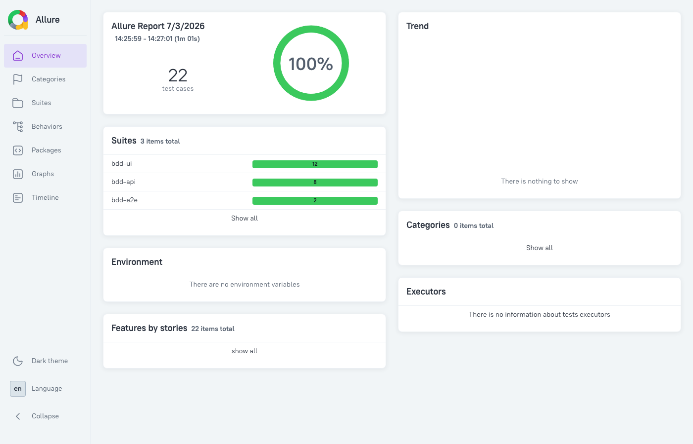
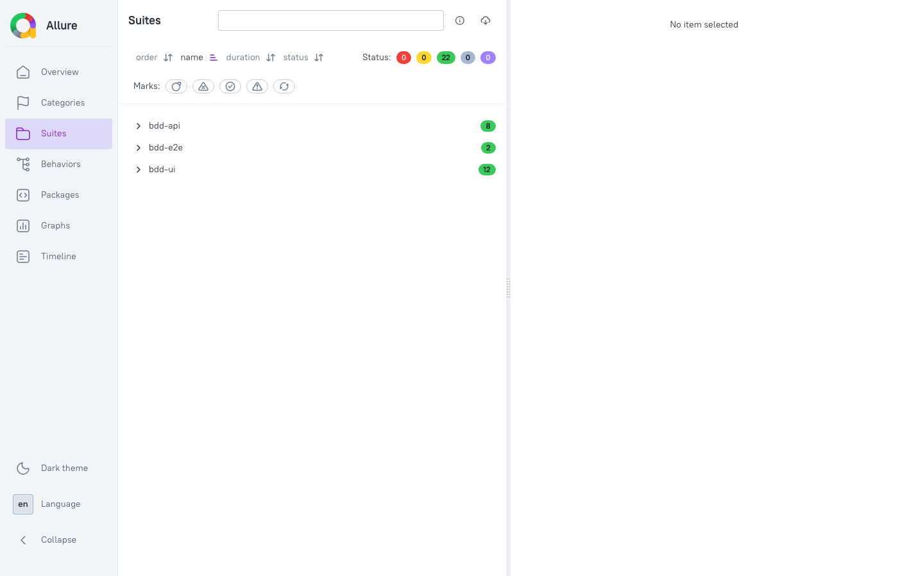

# restful-bdd-api-testing

[](https://github.com/MarianoCuria/restful-bdd-api-testing/actions/workflows/tests.yml)
[](https://github.com/MarianoCuria/restful-bdd-api-testing/actions/workflows/allure-pages.yml)

Portfolio project combining **BDD with Playwright**, **API testing**, and **UI + API E2E verification**, targeting the [Restful Booker Platform](https://automationintesting.online/) and the [Restful Booker API](https://restful-booker.herokuapp.com/).

**Author:** Mariano Curia · **License:** [MIT](LICENSE)

---

## Demo flow

A typical end-to-end scenario in this suite:

1. **UI** — A guest books a room on the hotel website and sees *Booking Confirmed*
2. **API** — The test logs into the platform API and verifies the booking exists in `/api/booking?roomid=1`
3. **Report** — Allure captures every step, screenshot and trace for debugging

The same pattern applies to the contact form: submit via UI → confirm success message → verify the message in `/api/message`.

---

## What this project demonstrates

| Layer | Approach | Target |
|-------|----------|--------|
| **BDD / UI** | `playwright-bdd` — Gherkin features + Page Object Model | Hotel booking UI |
| **BDD / API** | Gherkin + typed `BookingApiClient` | Restful Booker REST API |
| **E2E hybrid** | UI action → platform API assertion | Same backend as the UI |
| **Reporting** | Allure — steps, screenshots, traces | All layers |
| **CI** | GitHub Actions — 3 parallel jobs + GitHub Pages | Push / PR / manual dispatch |

---

## Allure report

Live report (published on every push to `main`):

**https://marianocuria.github.io/restful-bdd-api-testing/**

Local preview:

```bash
npm run test:all
npm run allure:report
```

<p align="center">
  
  <br/>
  <em>Overview dashboard — 22 scenarios across UI, API and E2E layers</em>
</p>

<p align="center">
  
  <br/>
  <em>Suites breakdown by project (bdd-ui, bdd-api, bdd-e2e)</em>
</p>

---

## Project structure

```
restful-bdd-api-testing/
├── features/
│   ├── booking/          # UI: create, validate, room selection
│   ├── availability/     # UI: date search
│   ├── contact/          # UI: contact form
│   ├── api/              # API: CRUD, auth, search, validation
│   └── e2e/              # Hybrid: UI action + API verification
├── steps/                # Step definitions per layer
├── pages/                # Page Object Model (HomePage, RoomPage)
├── support/              # Playwright fixtures (UI, API, E2E)
├── helpers/
│   ├── api-client.ts           # Restful Booker API wrapper
│   └── platform-api-client.ts  # Platform API wrapper (automationintesting.online)
├── docs/images/          # Allure report screenshots for README
├── playwright.config.ts
└── .github/workflows/
    ├── tests.yml         # CI — 3 parallel test jobs
    └── allure-pages.yml  # Publish Allure to GitHub Pages
```

---

## Test coverage — 22 scenarios

### UI (bdd-ui) — 12 scenarios
- Create booking, form validation, room types (Single/Double/Suite)
- Check availability by date
- Contact form (positive + negative)

### API (bdd-api) — 8 scenarios
- Full CRUD lifecycle
- Auth failures (invalid credentials, missing token)
- Search by guest name and checkin date
- Error handling (404, empty payload)

### E2E hybrid (bdd-e2e) — 2 scenarios
- Guest books via UI → booking verified in platform API
- Guest sends message via UI → message verified in platform API

---

## Running locally

```bash
npm ci
npx playwright install chromium

npm run test:bdd       # UI tests
npm run test:bdd-api   # API BDD tests
npm run test:e2e       # UI + API hybrid
npm run test:all       # Everything (22 tests)

npm run allure:report  # Open Allure report
```

---

## Key design decisions

**Why `playwright-bdd`?**
Single runner for UI, API and E2E — shared fixtures, tracing, and Allure reporting without maintaining separate Cucumber + Playwright setups.

**Why separate API clients?**
The UI (`automationintesting.online`) and the public Restful Booker API (`restful-booker.herokuapp.com`) are different backends. Each has its own typed client so HTTP details never leak into step definitions.

**Why E2E hybrid tests?**
They prove the full stack: a UI action (booking, contact form) actually persists in the platform backend, not just that the UI shows a confirmation message.

---

## CI

| Workflow | Trigger | What it does |
|----------|---------|--------------|
| [`tests.yml`](.github/workflows/tests.yml) | Push / PR | Runs API, UI and E2E jobs in parallel |
| [`allure-pages.yml`](.github/workflows/allure-pages.yml) | Push to `main` | Publishes Allure report to GitHub Pages |

UI and E2E jobs use **2 retries in CI** to handle flakiness on the shared demo site.

> **First-time setup:** Enable GitHub Pages in repo Settings → Pages → Source: **GitHub Actions**.

---

## Environment variables

| Variable | Default | Used by |
|----------|---------|---------|
| `PLATFORM_ADMIN_USER` | `admin` | E2E platform API login |
| `PLATFORM_ADMIN_PASSWORD` | `password` | E2E platform API login |

---

## Tech stack

- TypeScript
- Playwright + playwright-bdd
- Allure reporting
- GitHub Actions CI + GitHub Pages
